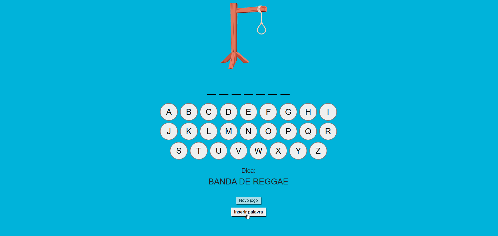

# Challenge Alura | Jogo da Forca

> Este desafio Alura propôs a criação de um jogo da forca, semelhante ao que brincávamos na escola, onde, o jogador, letra a letra, tentava descobrir uma palavra oculta. A cada tentativa frustrada, via seu boneco sendo desenhado parte a parte na forca. A cada letra correta, a palavra ficava mais evidente. Ao final, se o boneco fosse enforcado você perdia, e se descobrisse a palavra oculta você vencia. 

  

## Jogo da Forca - Dinâmica do jogo

Cada vez que uma letra é clicada, ela desaparece do painel. Se estiver correta, ocupará seu lugar na palavra secreta. Se estiver incorreta, irá compor mais uma parte do corpo do boneco na forca. 

  

## Jogo da Forca - Vencedor

Ao final de cinco tentativas, se adivinhar a palavra oculta, você vence o jogo impedindo que seu boneco seja enforcado. 

  

## Jogo da Forca - Perdedor

Mas, se ao final das cinco tentativas, não adivinhar a palavra oculta, você presenciará o enforcamento do seu bonequinho. 

  

## Jogo da Forca - Reinício

Ao clicar em **Novo Jogo**, a partida reinicia com uma nova palavra acompanhada de uma dica para auxiliar o jogador.

  

## Jogo da Forca - Inserindo uma nova palavra I

Também é possível inserir novas palavras à brincadeira clicando no botão **Inserir palavra**.

  

## Jogo da Forca - Inserindo uma nova palavra II

Ao clicar no botão **Inserir palavra**, uma nova tela se abre permitindo ao jogador inserir uma nova palavra e categoria ao jogo. De acordo com as regras do desafio, o campo *Palavra secreta aceita somente letras maiúsculas e sem caracteres especiais.

  

## Jogo da Forca - Inserindo uma nova palavra III

Caso a palavra já esteja cadastrada, o programa alerta ao usuário para cadastrar outra palavra.

  

## Jogo da Forca - Voltando ao jogo

Após cadastrar a nova palavra, basta clicar em **Voltar ao jogo** para a brincadeira recomeçar.

